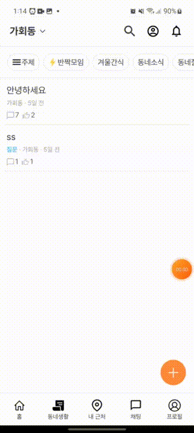

## 당근마켓 클론코딩 프론트엔드

### 1. 개요  

당근마켓의 UI/UX를 빌려 임의로 코드를 작성해 만든 앱입니다. 개인 포트폴리오용으로 작성되었습니다.  
   
**웹: [🔗웹사이트](https://app.bunnyscarrot.com 'https://app.bunnyscarrot.com')**  
**Android: [🔗APK 다운로드](https://drive.google.com/file/d/1GlTDVVdqjyq5__q2r-og7riKn7pKZDKO/view?usp=share_link 'https://drive.google.com/file/d/1GlTDVVdqjyq5__q2r-og7riKn7pKZDKO/view?usp=share_link')**  
**IOS: N/A**  
  

*테스트용 아이디 및 비밀번호*

|No.|ID|PASSWORD|
|------|---|---|
|1|dd|dd|
|2|ss|ss|
|3|as|as|

---

### 2. Quick Features  

- 사용자 인증: 회원가입 / 로그인`(JWT 인증)` / 로그아웃 / 탈퇴
- 위치 설정: 내 지역 및 근처 동네 범위 설정
- 상품 등록 및 삭제, 찜하기
- 동네생활 포스트 작성 및 삭제, 댓글 및 대댓글 작성, 찜하기 및 공감
- 유저 간 채팅  
- 웹사이트 호스팅: Netlify  

---  

### 3. 사용된 기술 스택

- **ReactJs**
- **Typescript**
- **Context API** / **Axios, React Query**  

---  

### 4. 구현 예

  **1. 회원가입**  
  
    
  
  **2. 메인 페이지**  
  
    
  
  **3. 동네 변경**  
  
  
  
  **4. 동네생활 댓글 작성**  
  
  
  
  **5. 채팅**  
  
  
